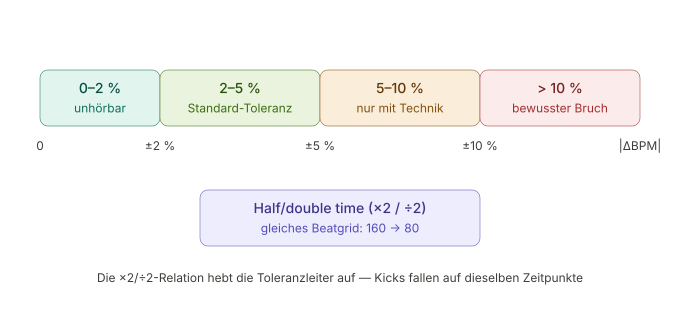

# BPM Theory — Transition Rules & Sequencing Logic

## 1. Warum ΔBPM der dominante Übergangsfaktor ist

Das Gehör verankert sich beim Hören auf dem Beatgrid — dem regelmäßigen Raster der Kicks. Ein Trackwechsel wirkt dann „nahtlos", wenn das neue Raster als Fortsetzung des alten wahrgenommen wird. Entscheidend ist dabei nicht der absolute BPM-Wert, sondern die relative Differenz: 5 BPM Sprung bei 80 BPM (6,3 %) ist deutlich hörbarer als 5 BPM bei 170 (2,9 %). Deshalb sollte der Builder intern immer in Prozent (bzw. log2-Ratio) rechnen, nie in absoluten BPM-Deltas.

Interessant: DJs sind im Bereich 120–139 BPM nachweislich am treffsichersten in der Tempowahrnehmung — eine Pilotstudie zeigte, dass professionelle DJs in ihrem meisttrainierten Bereich 120–139 BPM signifikant genauere Tempo-Urteile abgeben als Untrainierte, und innerhalb der DJ-Gruppe war dieser Bereich genauer als langsamere Tempi von 80–119 BPM. Das gilt vermutlich abgeschwächt auch für Hörer: Im Phase-C-Bereich fallen Tempo-Inkonsistenzen eher auf als in Phase A/D.

---

## 2. Die Toleranzleiter



Was hinter den Zonen steckt: Die Standard-Toleranz kommt direkt aus der DJ-Praxis — DJs nutzen Sortier- und Intelligent-Playlist-Funktionen, um Tracks innerhalb eines Fensters von etwa 5 BPM-Punkten auszuwählen, weil Beatmatching mit ähnlichen Ausgangstempi am saubersten funktioniert.

Jenseits davon wird es technisch: Große Tempoänderungen erzeugen hörbare Audio-Artefakte; DJs lösen das über sehr kurze Transitions innerhalb eines Takts, Echo-Effekte beim Ausstieg, kurze 1–2-Beat-Loops oder die „Meet in the middle"-Methode, bei der beide Tracks ihre BPM aufeinander zubewegen.

Ab ±10 % gilt: Das ist kein nahtloser Blend mehr, sondern ein bewusster **Gear Change** — die Crowd soll ihn spüren. Er funktioniert mit vollem Breakdown und sauberem Einstieg des neuen Tracks und eignet sich genau für Sektionswechsel im Set — was 1:1 dem Phasenwechsel im WOD-Kontext entspricht.

---

## 3. Sequenzierung innerhalb einer Phase: die Eskalationsrampe

Innerhalb einer Phase ist das Ziel nicht Tempo-Konstanz, sondern eine kontrollierte Bewegung. Ein Set, das 60 Minuten auf exakt einem BPM-Wert klebt, wirkt rhythmisch monoton — schon eine bewusste Bewegung von ±3–4 BPM über das Set erzeugt das Gefühl einer Reise. Die Schrittweite dafür ist gut etabliert: kleine, stetige Erhöhungen von nur 2–3 BPM pro Track halten den Fluss nahtlos, ohne dass es dem Publikum auffällt.

Für den Builder heißt das konkret:

- **Phase A** — darf flach mäandern; die Aufmerksamkeit liegt ohnehin nicht auf der Musik
- **Phase B** — sanfte Rampe (z. B. 95 → 100 → 104 → 108)
- **Phase C** — Rampe mit optionalem Wave-Muster bei langen WODs
- **Phase D** — dreht die Rampe um (absteigend Richtung 60–70 BPM)

Wichtig ist die **Monotonie-Regel**: Innerhalb von B und C sollte das Tempo nie zurückfallen, weil ein BPM-Rückschritt als Energieverlust gelesen wird — selbst wenn er innerhalb der ±5-%-Toleranz liegt.

Ein Nebeneffekt, der für die Camelot-Logik relevant ist: Tempoänderung über Pitch verändert auch die Tonhöhe und damit die Tonart, was harmonisches Mixing erschwert — moderne DJ-Technik löst das per Key-Lock. Da der Builder Tracks unverändert abspielt (kein Pitching), bleibt der Camelot-Code stets der getaggte — ein Problem weniger.

---

## 4. Phasenübergänge: drei Mechanismen

### Mechanismus 1 — Half/Double-Time (der elegante Weg)

Erfahrene DJs wissen, dass 150 BPM und 75 BPM faktisch dasselbe Tempo sind: ein Track hat einfach zwei Beats für jeden Beat des anderen — die Beats liegen automatisch übereinander, ohne dass Pitch-Shifting nötig wäre, und das funktioniert in beide Richtungen.

Praktisch: Wenn das Set auf hohe BPM hochläuft (z. B. 155+), kann ein Track mit exakt halbem BPM eingemixt werden — von 156 in einen 78-BPM-Track. Das ist der ideale C→D-Übergang: Der Cool-Down-Track fühlt sich rhythmisch wie eine Fortsetzung an, halbiert aber das gefühlte Tempo.

DJ.Studio deckelt die Tempoänderung innerhalb einer Transition bei etwa 25–30 % — ist die Differenz größer, wird automatisch auf Double/Half-Tempo ausgewichen statt das Audio weiter zu strecken. Das validiert die Architekturentscheidung, ×2/÷2 als first-class Kompatibilität zu behandeln statt als Sonderfall.

### Mechanismus 2 — Der bewusste Cut (Gear Change)

Für A→B und B→C ist ein hörbarer Bruch nicht nur akzeptabel, sondern funktional: Er signalisiert den Phasenwechsel. Hier darf der Builder die Toleranzleiter komplett ignorieren — der erste Track der neuen Phase wird nach Phasen-Score gewählt, nicht nach Kompatibilität zum letzten Track der alten.

### Mechanismus 3 — Graduelle Tempo-Arcs (nur mit echtem Mixing relevant)

Bei sehr großen Änderungen — etwa 170 runter auf 120 — loopen DJs den Master-Track und ziehen den Loop langsam herunter, wie ein elongierter Vinyl-Break, während der nächste Track bereits mitläuft; zwei Tracks gleichzeitig im Mix zu haben verschleiert, was passiert. Das ist im Builder-Kontext nicht umsetzbar, aber gut zu wissen für eine eventuelle spätere Crossfade-Stufe.

---

## 5. Implikationen für den Builder

Die wichtigste Einordnung zuerst: **Der Builder mischt nicht, er reiht.** Spotify spielt Track-Ende → Track-Anfang als harten Schnitt (bestenfalls mit Spotify-eigenem Crossfade von wenigen Sekunden). Damit verschiebt sich die Bedeutung der BPM-Regeln.

Die ±5-%-Toleranz beschreibt im DJ-Kontext, wie weit man pitchen kann, ohne dass es unnatürlich klingt — diese Grenze existiert beim Builder gar nicht, weil nichts gepitcht wird. Was bleibt, ist die gefühlte Tempo-Kontinuität über den Schnitt hinweg: Springt das Tempo nach dem Cut spürbar, reißt der Flow. Die Toleranzleiter gilt also weiterhin, aber als Wahrnehmungs-, nicht als Technik-Grenze.

Gleichzeitig wird der Cut selbst zum natürlichen Maskierer — derselbe Effekt, den DJs mit Echo-Outs künstlich erzeugen, passiert hier von allein. Das rechtfertigt, die Zone „5–10 %" im Builder etwas milder zu bestrafen, als es ein Crossfade-System müsste.

### Score-Funktion

Daraus ergibt sich eine saubere Score-Funktion für Track→Track innerhalb einer Phase, gerechnet im log2-Raum (damit ×2/÷2 trivial wird):

```
ratio = bpm_next / bpm_prev
d = min( |log2(ratio)|, |log2(ratio/2)|, |log2(ratio*2)| )
```

| d | Score | Bedeutung |
|---|-------|-----------|
| ≤ 0.030 | **1.0** | ≈ ±2 %, unhörbar |
| ≤ 0.070 | **0.85** | ≈ ±5 %, Standard |
| ≤ 0.135 | **0.4** | ≈ ±10 %, nur ok wenn Energy/Camelot stark |
| > 0.135 | **0.0** | innerhalb Phase vermeiden |

### Sequenzierungs-Constraints

Dazu drei Regeln als Constraints obendrauf:

1. **Richtungs-Monotonie in B/C** — effektives BPM darf nicht sinken
2. **Bevorzugte Schrittweite** — +1,5–2,5 % pro Track für die Rampe
3. **Phasenwechsel: Score-Befreiung** — außer C→D, wo ein ×2/÷2-Match aktiv gesucht und gebont werden sollte

Wichtig bei der Half/Double-Normalisierung: Sie gehört in den Übergangs-Score und in den Phasen-Fit (ein 75-BPM-Track mit Double-Time-Feel qualifiziert für Phase C), aber die Rampen-Monotonie muss auf dem normalisierten effektiven BPM laufen, sonst erzeugt ein 78er-Track nach einem 156er einen scheinbaren Absturz, der keiner ist.
